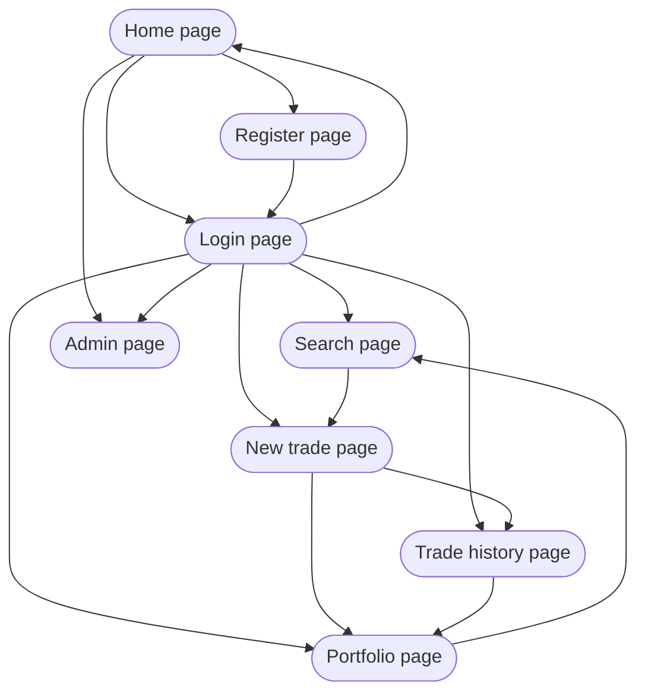
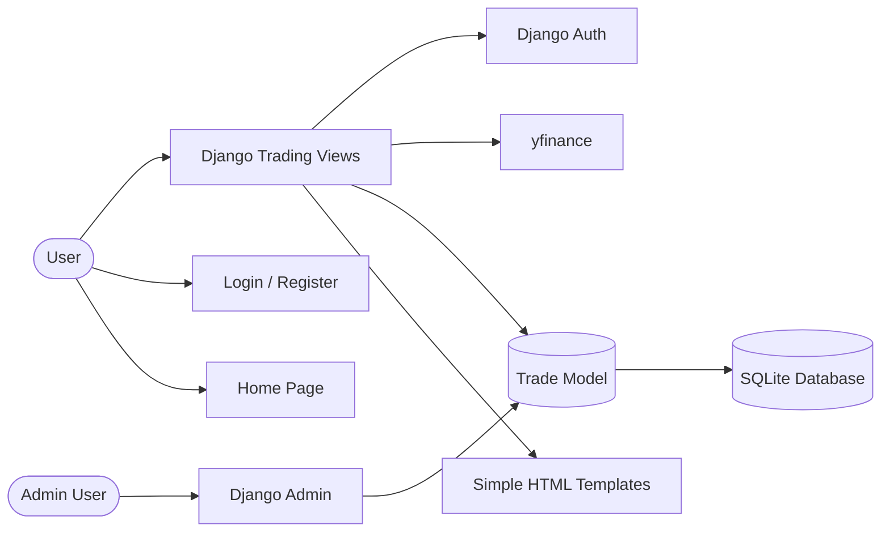
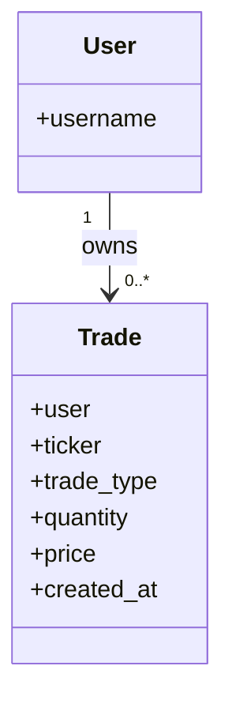
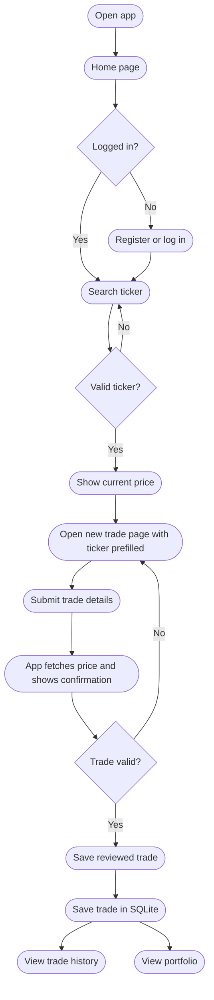
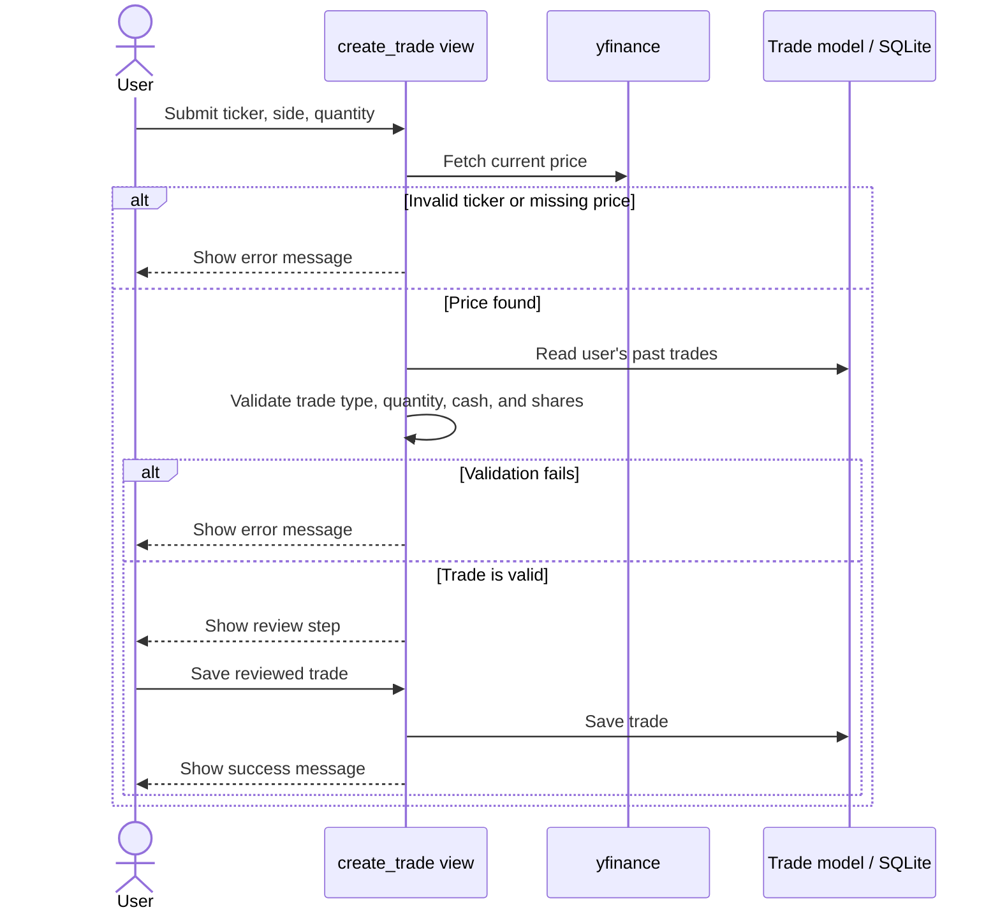

# CY300 Paper Trading App

This repo is my CY300 class project. I built it as a simple paper trading web app with Django so a user can create an account, look up a stock ticker, place fake buy and sell trades, and then see those trades show up in a portfolio and trade history.

I kept the project intentionally small. The goal was not to build a full trading platform. The goal was to build something that works, stores data correctly, and is easy to explain in a class presentation.

## What The App Does

- lets a user create an account, log in, and log out
- looks up stock prices with `yfinance`
- shows a few extra stock details on the search page, like previous close and day range
- saves paper `BUY` and `SELL` trades in SQLite
- uses a two-step trade flow so the user can review the price before confirming the trade
- lets the user jump from search results straight into the trade page with the ticker prefilled
- shows a portfolio page based on saved trades
- shows a trade history page with past transactions
- lets me inspect saved data in Django admin

## Why I Built It This Way

I wanted this project to stay at a level that made sense for a class MVP. Instead of adding a lot of extra architecture, I kept it centered around Django views, templates, one main `Trade` model, and SQLite. That made it easier to build, easier to debug, and easier to explain.

The Mermaid diagrams below are there to make the app flow and page structure easier to understand at a glance.

## Main Pages

| Page | Route | What it is for |
|---|---|---|
| Home | `/` | Landing page and starting point |
| Register | `/accounts/register/` | Create a new account |
| Login | `/accounts/login/` | Log in to the app |
| Search | `/search/` | Search a ticker, view price details, and jump into a trade |
| New Trade | `/trade/new/` | Enter a trade, review the fetched price, and save it |
| Trade History | `/trades/` | See saved trades for the logged-in user |
| Portfolio | `/portfolio/` | See current holdings and summary values |
| Admin | `/admin/` | Check saved data as an admin user |

## How The Pages Connect

This is the basic page map for the app.



## App Structure

At a high level, the app is just Django views talking to templates, the `Trade` model, Django auth, and `yfinance`.



## Stored Data

The data model is intentionally small. The app stores paper trades directly and calculates holdings from those trades instead of using extra portfolio tables.



## Main User Flow

This is the normal path through the app during a demo.



## Trade Confirmation Flow

I added a two-step trade flow so a trade is not saved the moment the user fills out the form. The user submits the trade first, sees the current fetched price, and then saves the reviewed trade.



## How To Run It

1. Clone the repo:

```powershell
git clone https://github.com/noahstephenson/Paper-Trading-App.git
cd Paper-Trading-App
```

2. Create a virtual environment if you do not already have one:

```powershell
python -m venv .venv
```

3. Activate the virtual environment:

```powershell
.\.venv\Scripts\Activate.ps1
```

4. Install the dependencies:

```powershell
pip install -r requirements.txt
```

5. Run migrations:

```powershell
python manage.py migrate
```

6. Create an admin user:

```powershell
python manage.py createsuperuser
```

7. Start the server:

```powershell
python manage.py runserver
```

8. Open the app:

- App: [http://127.0.0.1:8000/](http://127.0.0.1:8000/)
- Admin: [http://127.0.0.1:8000/admin/](http://127.0.0.1:8000/admin/)

## Simple Demo Flow

If I were showing this project in class, this is the path I would take:

1. Open the home page.
2. Create an account or log in.
3. Search a ticker like `AAPL`.
4. Click into the trade page and enter a `BUY`.
5. Review the fetched price.
6. Save the trade.
7. Open trade history to show the saved row.
8. Open portfolio to show the updated holdings.
9. Open Django admin to show the data in the database.

## Tech Used

- Django
- SQLite
- `yfinance`
- HTML templates
- Mermaid for project diagrams

## Project Scope

This app is meant to be a clear MVP, not a production trading platform.

It does not include:
- real-money trading
- brokerage integration
- React
- REST APIs
- advanced dashboards
- options trading
- machine learning or recommendations

The main idea was to keep the code understandable and focused on core Django concepts like routing, views, templates, models, forms, authentication, and database persistence.

## Mermaid Diagram Files

The full set of Mermaid source files is kept in the [Mermaid Diagrams](./Mermaid%20Diagrams/) folder:

- [app-structure-diagram.mmd](./Mermaid%20Diagrams/app-structure-diagram.mmd)
- [class-diagram.mmd](./Mermaid%20Diagrams/class-diagram.mmd)
- [django-structure.mmd](./Mermaid%20Diagrams/django-structure.mmd)
- [mvp-user-flow.mmd](./Mermaid%20Diagrams/mvp-user-flow.mmd)
- [page-map.mmd](./Mermaid%20Diagrams/page-map.mmd)
- [trade-sequence.mmd](./Mermaid%20Diagrams/trade-sequence.mmd)
- [use-case-diagram.mmd](./Mermaid%20Diagrams/use-case-diagram.mmd)

## Author

Noah Stephenson  
CY300 Class Project
